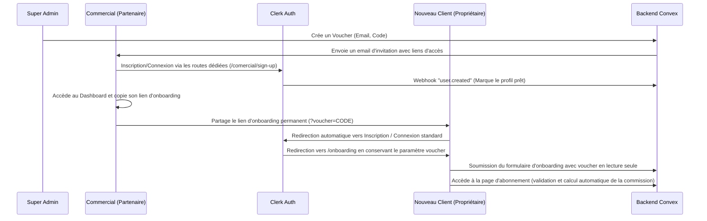

# Skill : Intégration d'Affiliation Commerciale et Suivi des Vouchers

Ce skill décrit l'implémentation complète d'un module d'affiliation pour des commerciaux, basé sur Clerk (authentification), Convex (base de données backend) et Next.js App Router (frontend).

## Flux Logique Complet

## Éléments Techniques Clés

### 1. Structure de Base de Données (Convex Schema)
Les entités requises sont :
- **`vouchers`** : Représente le code du commercial, son pourcentage de réduction pour les clients et sa commission.
- **`commissions`** : Suit les gains générés par chaque client affilié à un voucher.
- **`client/truck`** : Contient un champ optionnel `voucherCode` pour lier le client à son commercial.

### 2. Liens d'Authentification Dédiés pour les Commerciaux
Afin d'éviter que le commercial n'atterrisse sur l'onboarding standard de vos clients, il convient de créer des routes d'authentification spécifiques pour lui :
- **`/comercial/sign-up`** et **`/comercial/sign-in`**.
- Configurer Clerk pour forcer la redirection post-authentification vers le panel commercial (`/comercial/dashboard`) au lieu du flux client classique.
- Déclarer ces routes spécifiques comme publiques dans le middleware de routage.

### 3. Redirection automatique et Maintien du Voucher (Clerk & Next.js)
Pour que le client final ne perde pas le code voucher lors de son inscription :
- Intercepter les accès à `/onboarding?voucher=CODE` si le client n'est pas connecté et le rediriger automatiquement vers `/sign-up?voucher=CODE`.
- Configurer les fonctions `buildFallbackRedirectUrl` et les liens internes Clerk pour faire voyager le paramètre `voucher` à travers les formulaires et les sessions.
- Sur la page d'onboarding, afficher le voucher dans un champ textuel marqué comme `readOnly` pour rassurer le client sur l'application de sa réduction.

### 4. Validation Automatique sur la Page d'Abonnement
- Lorsque le client charge sa page d'abonnement, le système doit lire le `voucherCode` enregistré dans son profil et lancer immédiatement une requête de validation asynchrone auprès de la base de données.
- Si le voucher est trouvé et actif, le discount (ex: 10%) est mis à jour dans le state frontend pour recalculer et afficher le prix réduit de façon dynamique.
