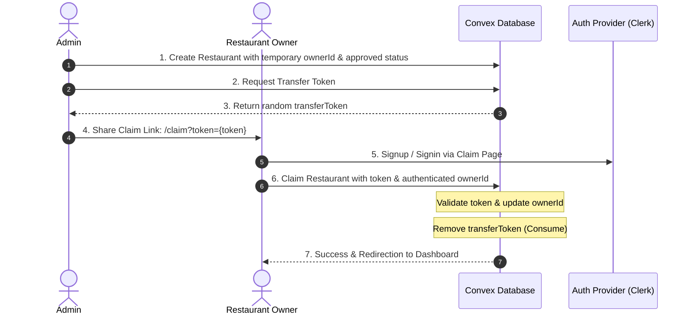

# Delegated Ownership Claim Flow

This skill describes the design pattern and implementation details for a delegated ownership flow. In this architecture, a **Superadmin** creates a resource (e.g., a restaurant) on behalf of an owner, generates a unique, one-time "magic claim link", and sends it to the prospective owner. When the user signs in and visits the link, they claim total ownership of the resource, and the superadmin no longer has direct write access (except through global admin overrides).

---

## 1. Core Architecture

The system uses three main components to achieve secure delegation:
1. **Unassigned Owner Marker**: When the admin creates the resource, it is assigned a temporary, unassigned owner ID (e.g., `admin_pending_[timestamp]`).
2. **Transfer Token**: A cryptographically random, one-time string (`transferToken`) is generated and saved on the resource document.
3. **Secure Claim Mutation**: A mutation validates the token, maps the resource to the authenticated user's ID, and immediately clears the `transferToken` to prevent replay attacks.



---

## 2. Implementation Steps

### A. Database Schema
Ensure the resource table (e.g., `restaurants`) has the following fields:
* `ownerId` (String, indexed): Identifies the current owner. If created by admin, initialized to a distinct temporary value.
* `transferToken` (String, optional, indexed): Holds the generated magic token. Removed upon successful claim.

### B. Superadmin Operations (Backend)

#### Generating the Transfer Token
Create a mutation that generates a secure token and patches the resource.
```typescript
// convex/admin.ts
import { v } from "convex/values";
import { mutation } from "./_generated/server";

export const generateTransferToken = mutation({
  args: {
    restaurantId: v.id("restaurants"),
    adminSecret: v.string(),
  },
  handler: async (ctx, args) => {
    // Validate superadmin secret or role
    checkAdminSecret(args.adminSecret);

    // Generate random token
    const token = Math.random().toString(36).substring(2, 15) + Math.random().toString(36).substring(2, 15);

    // Associate token with resource
    await ctx.db.patch(args.restaurantId, { transferToken: token });
    return token;
  }
});
```

### C. Claim Process (Backend)

#### Claiming the Resource
Create a mutation to transfer ownership. Crucially, the token must be cleared to prevent reuse.
```typescript
// convex/admin.ts
export const claimRestaurant = mutation({
  args: {
    transferToken: v.string(),
    newOwnerId: v.string(),
  },
  handler: async (ctx, args) => {
    // Query the resource using the token
    const restaurants = await ctx.db.query("restaurants").collect();
    const restaurantToClaim = restaurants.find(r => r.transferToken === args.transferToken);

    if (!restaurantToClaim) {
      throw new Error("Link de transferência inválido ou expirado.");
    }

    // Set new owner and remove the token so it can't be reused
    await ctx.db.patch(restaurantToClaim._id, {
      ownerId: args.newOwnerId,
      transferToken: undefined, // Consume token
    });
  }
});
```

### D. Frontend Integration

#### Superadmin Dashboard Action
In the admin dashboard, render a button to generate the link and copy it to the clipboard:
```typescript
async function handleGenerateToken(restaurantId: string) {
  const res = await generateTransferToken({ restaurantId });
  if (res?.success && res.token) {
    const claimLink = `${window.location.origin}/claim?token=${res.token}`;
    navigator.clipboard.writeText(claimLink);
    alert(`Link de transferência gerado e copiado:\n\n${claimLink}`);
  }
}
```

#### Claim Page (`/claim/page.tsx`)
Create a public route `/claim` that:
1. Detects the `token` URL query parameter.
2. Checks user authentication. If not logged in, redirects to login/signup while preserving the redirect URL.
3. Allows the authenticated user to click "Claim" to call the `claimRestaurant` mutation.
4. Redirects the user to their private dashboard once completed.

```tsx
import { useUser, SignUpButton, SignInButton } from "@clerk/nextjs";
import { useSearchParams, useRouter } from "next/navigation";
import { useMutation } from "convex/react";
import { api } from "@/convex/_generated/api";

function ClaimPage() {
  const { user, isSignedIn } = useUser();
  const searchParams = useSearchParams();
  const router = useRouter();
  const token = searchParams.get("token");
  const claimRestaurant = useMutation(api.admin.claimRestaurant);

  async function handleClaim() {
    if (!token || !user) return;
    try {
      await claimRestaurant({
        transferToken: token,
        newOwnerId: user.id,
      });
      router.push("/admin/dashboard");
    } catch (e: any) {
      alert("Erro ao assumir restaurante: " + e.message);
    }
  }

  if (!isSignedIn) {
    return (
      <div>
        <p>Crie uma conta ou faça login para assumir este restaurante.</p>
        <SignUpButton mode="modal" forceRedirectUrl={`/claim?token=${token}`}>
          <button>Criar Conta</button>
        </SignUpButton>
      </div>
    );
  }

  return (
    <div>
      <p>Você está conectado como {user.primaryEmailAddress?.emailAddress}.</p>
      <button onClick={handleClaim}>Assumir Controle do Restaurante</button>
    </div>
  );
}
```

---

## 3. Best Practices & Security
1. **One-Time Use**: Always set the `transferToken` to `undefined` immediately upon first claim.
2. **Access Control**: Once claimed, queries filtering by `ownerId === currentUserId` will naturally exclude this restaurant from the superadmin's regular management views and expose it only to the new owner.
3. **Token Expiry**: Consider adding a `transferTokenExpiry` timestamp if you wish to automatically invalidate links after a certain period (e.g., 48 hours).
